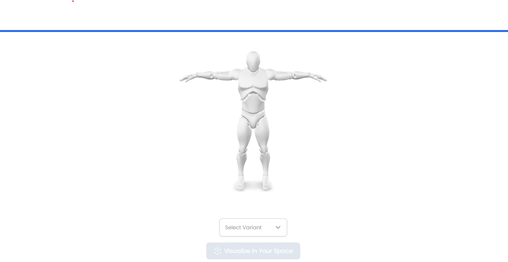
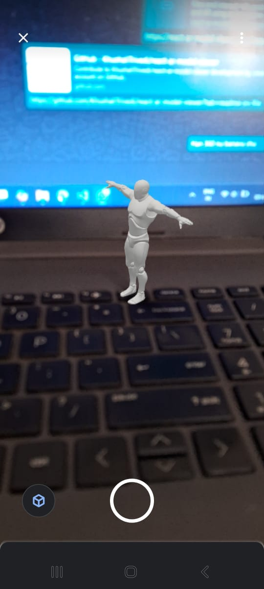

# 🧿 AR 3D Model Viewer with Color Variants

A modern React-based application that allows users to interactively view 3D models in their own space using **Augmented Reality (AR)**. Built on top of [`@google/model-viewer`](https://github.com/google/model-viewer), the app includes support for **dynamic color variants**, giving users a personalized and immersive experience.

---

## 🚀 Features

- 🌐 Web-based 3D viewer powered by `@google/model-viewer`
- 📱 AR support via **WebXR**, **Scene Viewer** (Android), and **Quick Look** (iOS)
- 🎨 Switch between multiple **color variants** of the model
- ⚡ Smooth material color updates using `setBaseColorFactor`
- ✅ Mobile detection for AR button activation
- 🧠 Optimized performance and clear UI

---

## 🖼️ Demo




---

## 📦 Tech Stack

- [React](https://reactjs.org/)
- [@google/model-viewer](https://modelviewer.dev/)
- TypeScript
- CSS-in-JS (inline styles for simplicity)

---

## 🎨 Color Variants Example

Variants are defined like so:

```ts
const ar_view_variants = [
  { color: "Black", code: "#000000", variant_id: "01" },
  { color: "White", code: "#FFFFFF", variant_id: "02" },
  { color: "Charcoal Gray", code: "#333333", variant_id: "03" },
  { color: "Stone Gray", code: "#7D7D7D", variant_id: "04" },
  { color: "Ivory", code: "#F9F9F6", variant_id: "05" },
  { color: "Navy Blue", code: "#1A2B3C", variant_id: "06" },
  { color: "Olive", code: "#556B2F", variant_id: "07" },
  { color: "Taupe", code: "#8B8589", variant_id: "08" },
];
```

## 🛠️ Setup & Run

# Clone the repo

git clone https://github.com/yourusername/ar-3d-viewer.git

# Navigate to project

cd ar-3d-viewer

# Install dependencies

npm install

# Run locally

npm run dev
